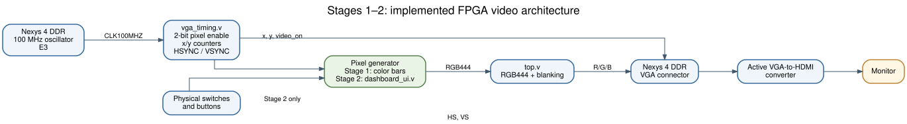

# System Architecture

## Objective and scope

This design incrementally implements a VGA video system on the **Nexys 4 DDR** using **Verilog** and **Vivado**. In Stage 1, the Artix-7 generates an eight-color test pattern. In Stage 2, the same VGA controller supports a switch- and button-controlled dashboard. Both versions generate pixel colors directly from raster coordinates; neither stores a complete image in a frame buffer.

*Figure 1: The implemented Stage 1/2 design. The pixel-color block is the Stage 1 color-bar logic **or** the Stage 2 dashboard renderer. The VGA-to-HDMI converter is external hardware, not an FPGA module.*

## RTL components

| Component | Stage | Inputs | Outputs | Function |
|---|---|---|---|---|
| `vga_timing.v` | 1 and 2 | `clk` at 100 MHz | `x`, `y`, `hsync`, `vsync`, `video_on` | Maintains raster location and generates the VGA synchronization signals. |
| `top.v` (Stage 1) | 1 | `CLK100MHZ` | `VGA_R`, `VGA_G`, `VGA_B`, `VGA_HS`, `VGA_VS` | Instantiates timing logic and selects an eight-bar test pattern using `x`. |
| `dashboard_ui.v` | 2 | `x`, `y`, `video_on`, `speed`, `battery`, `warning`, turn flags | `rgb[11:0]` | Computes the pixel color for the dashboard at each visible coordinate. |
| `top.v` (Stage 2) | 2 | Clock, slide switches, pushbuttons | VGA RGB and sync | Connects onboard inputs to the dashboard and extracts 4-bit red, green, and blue values. |

Both versions use the same `vga_timing.v`; they have **different `top.v` files**. Enable only the matching top-level file for the stage you are building.

## Pixel path

1. The 100 MHz board oscillator drives the pixel-enable counter in `vga_timing.v`.
2. Every fourth board clock, a pixel enable advances the raster coordinates. `x` counts 0–799; `y` counts 0–524.
3. Combinational comparisons derive HSYNC, VSYNC and `video_on` from `(x,y)`.
4. The renderer calculates the color associated with the current pixel. Stage 1 selects one of eight bars; Stage 2 evaluates dashboard shape boundaries and user input levels.
5. The top module passes RGB444 and sync to the board's VGA output. During blanking it drives black (`RGB=0`).
6. The board's analog VGA output passes through an **active external VGA-to-HDMI converter** before reaching the monitor used for the demonstrations.

These are logical signal dependencies, **not** software instructions that execute sequentially. The FPGA implements concurrent circuits.

## Why there is no framebuffer yet

Every current pixel can be computed from `(x,y)` and the switch/button states. There is no need to store an image. A live OV7670 will supply pixel bytes under its **own** PCLK; the future camera version must capture them, cross clock domains safely, and manage complete frames before composition. Those blocks are planned, not present in this architecture figure.
