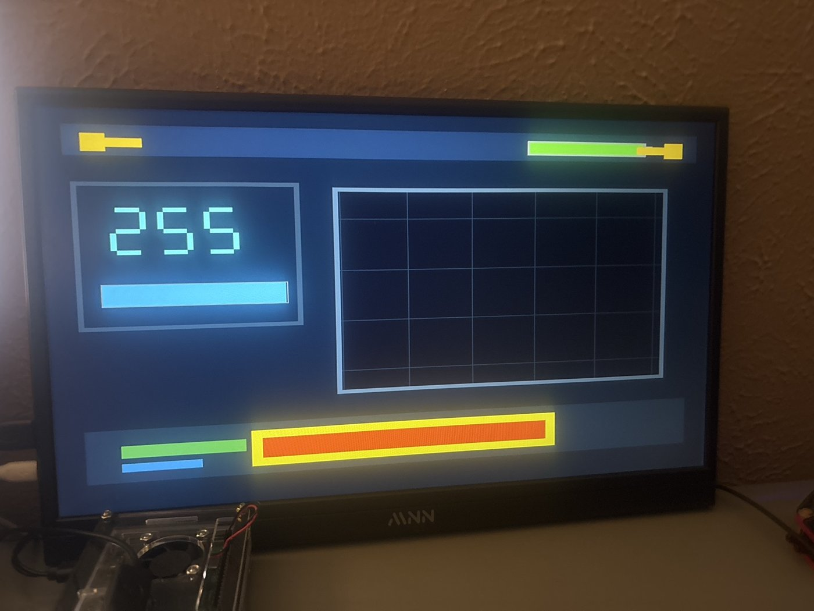
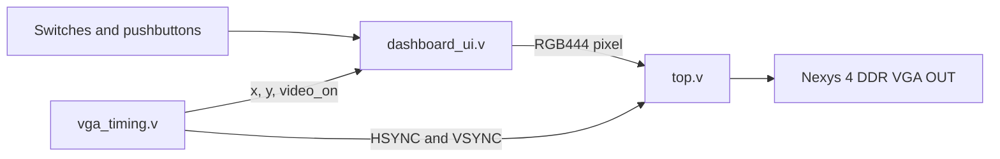
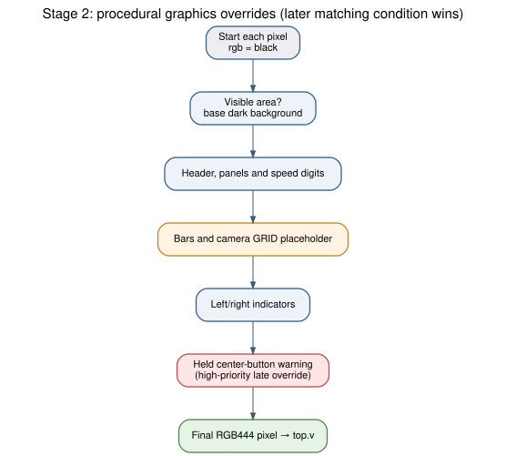

# Dashboard Renderer — Stage 2

## Objective and hardware result

Stage 2 replaces the color bars with an **interactive raster-rendered dashboard**. The FPGA calculates each pixel from coordinate comparisons and switch/button input states. There is **no framebuffer**, live camera image, operating-system graphics stack, or soft processor in this version.



## Data flow and hardware interfaces



| Physical input | RTL connection | Demonstrated behavior |
|---|---|---|
| `SW[7:0]` | `speed` | Values 0–255 are shown using large digits and a cyan bar. |
| `SW[15:12]` | `battery` | Values 0–15 control the green/orange battery fill. |
| Center button `BTNC` | `warning` | A red box with a yellow border appears in the lower panel while pressed. |
| Left button `BTNL` | `turn_left` | Left yellow marker appears while pressed. |
| Right button `BTNR` | `turn_right` | Right yellow marker appears while pressed. |

`SW[8:11]` were constrained in the Stage 2 XDC but are not used by `dashboard_ui.v`.

## The 12-bit pixel format

The internal pixel is `rgb[11:0]` in **RGB444** format: `rgb[11:8]` is red, `rgb[7:4]` green, and `rgb[3:0]` blue. The board exposes four digital bits per VGA color channel, which feed its onboard resistor DAC. Examples: `12'hF00` is bright red; `12'h0FF` is cyan; `12'h012` is a very dark blue background.

In Stage 2 `top.v`, the output assignments unpack this pixel into the three physical VGA buses and force black when `video_on=0`.

## How digits are rendered

The 8-bit `speed` value is converted into three decimal digits using constant division and modulo:

```verilog
assign hundreds = speed / 8'd100;
assign tens     = (speed % 8'd100) / 8'd10;
assign ones     = speed % 8'd10;
```

For an input of 255, these expressions produce **2**, **5** and **5**. The `seg_pixel` function selects a conventional seven-segment bit pattern and tests whether the current `(x,y)` falls inside each enabled segment's rectangle. Its return value tells the renderer whether the pixel belongs to a digit. The logic also hides unnecessary leading zeros when speed is below 10 or 100.

This method avoids storing a font image. A **font ROM** or **binary-to-BCD (double-dabble) converter** would be alternatives to investigate if the display becomes more complex or timing reports indicate excessive logic depth.

## Speed and battery bars

```verilog
assign speed_scaled      = speed * 8'd160;
assign speed_bar_width   = speed_scaled[15:8];
assign battery_bar_width = battery * 8'd8;
```

Speed is 8-bit (0–255). The bar width uses `(speed × 160) >> 8`, replacing division by 256 with a slice of the multiplication result. The maximum visible fill is about **159** pixels. Battery is 4-bit (0–15); every step adds 8 pixels, reaching **120 pixels** at the maximum value. Low battery values below four select an orange/red fill in the current graphics.

## Layer priority



`dashboard_ui.v` uses one combinational `always @(*)` block. It assigns a default black value and then draws later shapes on top of earlier shapes with subsequent assignments. That creates a basic **painter's algorithm**: the dashboard background is replaced by panels, digits, bars, and, with higher priority, input-driven indicators or warnings.

For the camera placeholder, the expression `(x[5:0] == 0) || (y[5:0] == 0)` draws a grid at 64-pixel intervals. The rectangle is only a placeholder; there are no camera pixels in the present design.

## Current limitations

- Direct switch and button levels are adequate for held-button graphics, but edge-triggered controls should add synchronizers and debounce logic.
- The current renderer is one large combinational block. Separate layer modules with explicit valid/color outputs would be easier to extend to a real camera compositor.
- The project has not yet measured renderer latency, resource usage, or full timing closure. Those belong in the [verification page](verification.md) once reports have been captured.
