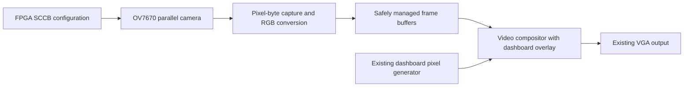

# Design Decisions, Alternatives, and Future Work

## Design strategy

The project was deliberately built in independently testable stages. Stage 1 validates VGA output with eight color bars. Stage 2 changes the color source to a coordinate-driven dashboard without altering the shared timing controller. This separation made it possible to establish that VGA output worked before adding external camera capture, memory, and new clock domains.

## Design tradeoffs

| Design choice | Current implementation and reason | Alternative to evaluate |
|---|---|---|
| Clocking | 100 MHz board clock and `pixel_tick` every four cycles; all current registers remain in the board-clock domain. | Clock Wizard/MMCM for an explicit ~25.175 MHz pixel clock; manage reset and lock behavior. |
| Video timing | 800 positions per line × 525 lines per frame, giving ~59.52 Hz at an effective 25 MHz. Tested monitor accepted it. | Parameterized timing and an exact standard-format clock when strict monitor compatibility is required. |
| Pixel color | RGB444 because the board's VGA output exposes four bits per color channel. | Higher internal precision followed by a final RGB444 conversion. |
| Stage 1 pattern | Eight bars check each primary RGB channel and combinations, not merely that the screen is on. | Ramps, checkerboards, or signal instrumentation for finer diagnostics. |
| Stage 2 graphics | Rectangles derived from `(x,y)` without frame memory. | Font/sprite ROMs and more modular compositing for richer UI. |
| Numeric display | Constant division/modulo and virtual seven-segment rectangles; quick to understand and demonstrate. | Binary-to-BCD conversion and a font ROM; compare resource and timing reports before choosing. |
| Layering | Sequential assignments in `always @(*)` allow later shapes to overwrite earlier ones; warning has high priority. | Per-layer pixel/valid interfaces, configurable priorities, alpha blending. |
| Inputs | Direct held levels from the onboard switches/buttons. | Input synchronizers and debounce/edge detectors for sampled events. |
| Camera placeholder | Gridded rectangle generated using coordinate-bit tests. | Replace with live pixels once an OV7670 frame-capture path is verified. |

These alternatives are **proposals**, not claims that the current implementation has been benchmarked against them.

## Current limitations

1. The camera area displays a synthetic grid, not live video.
2. There is no testbench evidence committed yet for boundary and corner cases, and no saved timing-closure or utilization numbers in this documentation.
3. The renderer is a large combinational process with hand-coded shapes, not a scalable sprite/font system.
4. Switches are uncalibrated demonstration inputs; speed and battery are simulated values, not actual vehicle telemetry.

## Next development stage: OV7670 integration (planned)

The camera will produce bytes under its own **PCLK**, not in the 100 MHz FPGA logic timing domain. The future buffer design must deliberately handle clock-domain crossing and frame ownership so the display does not read a frame while the camera is overwriting it. Merely attaching a short FIFO between independently timed full-frame camera and display streams does not establish correct long-term frame synchronization.

**Milestones:** verify the breakout's supply/I/O specifications and exact pins; generate XCLK; configure SCCB; prove PCLK/VSYNC/HREF timing; capture and pack RGB565 pixels; implement stable frame buffering; display live video; overlay the existing dashboard; collect waveform, utilization, and timing evidence. None of these planned tasks is marked complete.
