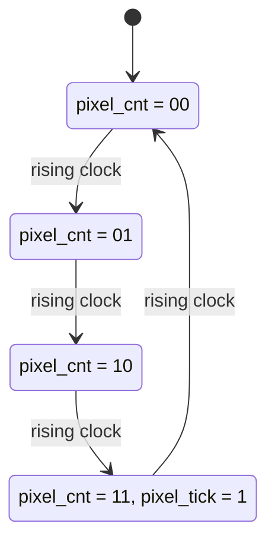
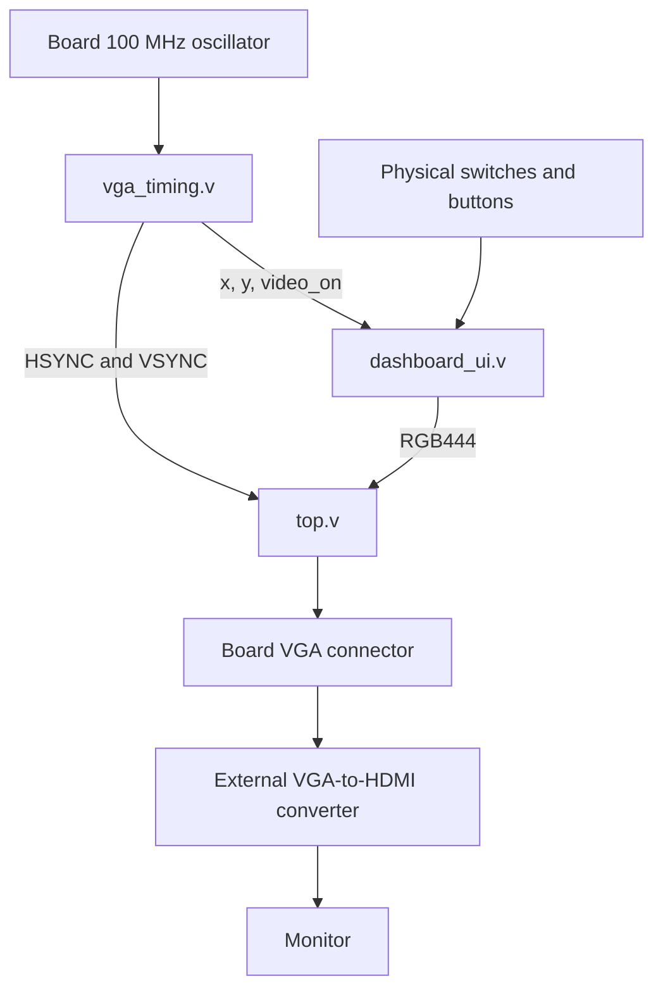

# Hardware Diagrams and UML-Style Models

Hardware block and timing diagrams are the main artifacts for this FPGA project. UML-style state and sequence diagrams supplement them where they describe genuinely sequential control behavior; HDL modules are concurrent circuits rather than software objects, so traditional class diagrams are not a good architecture representation.

## 1. Implemented system block diagram

Edit the source file [`diagrams/architecture.dot`](diagrams/architecture.dot) using [Graphviz](https://graphviz.org/), or reuse the SVG directly in your README.

## 2. Implemented VGA timing diagram

This shows the exact timing used: horizontally 640 active + 16 front porch + 96 sync + 48 back porch; vertically 480 active + 10 front porch + 2 sync + 33 back porch.

## 3. UML-style state diagram: 2-bit pixel enable

This diagram models the actual four states of `pixel_cnt`, not the entire video system. GitHub renders the Mermaid code directly:

Editable source: [`diagrams/pixel_enable_state.mmd`](diagrams/pixel_enable_state.mmd).

## 4. Data flow through implemented Stage 2

Editable source: [`diagrams/stage2_dataflow.mmd`](diagrams/stage2_dataflow.mmd).

## 5. Layer-priority diagram

The process initializes a base color, then later true conditions overwrite the current `rgb` value. The warning block is intentionally evaluated late to make its graphics high priority.

Editable source: [`diagrams/render_layers.dot`](diagrams/render_layers.dot).

## What to add with the camera later

After hardware capture is implemented and verified, add a **timing waveform** for the OV7670's PCLK, VSYNC, HREF and pixel-data bus, and a UML-style **sequence diagram** for the actual SCCB register-write sequence. Do not treat an illustrative sequence diagram as proof of the real module's timing.
