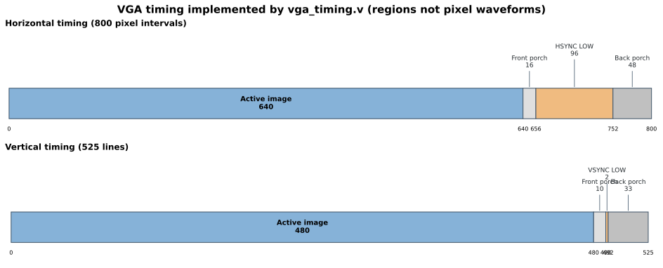
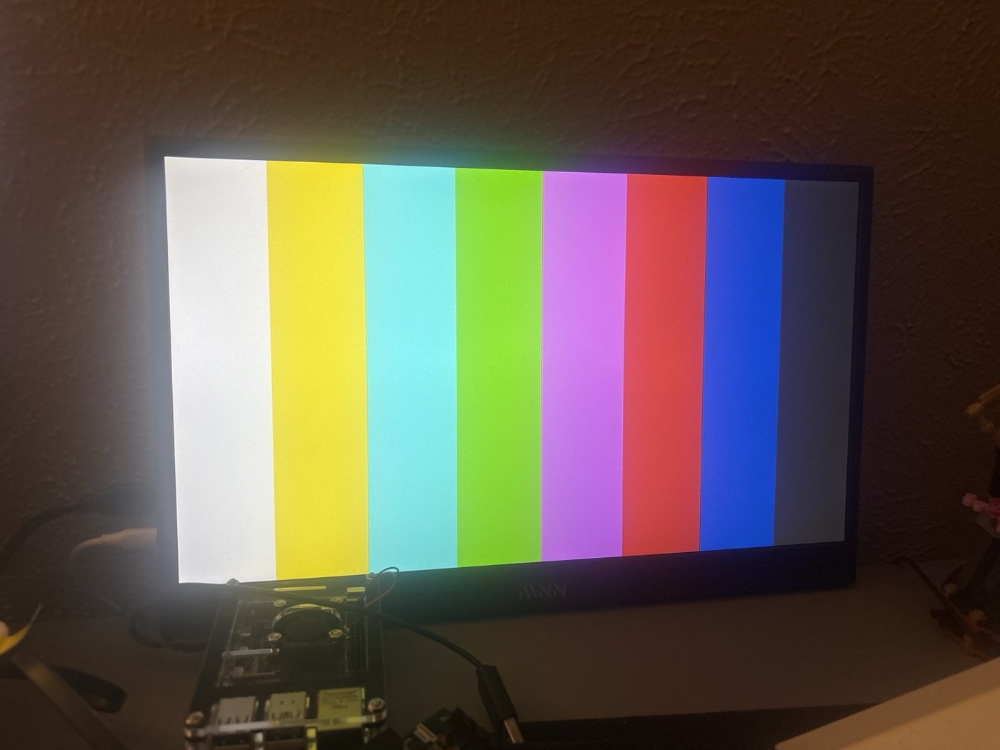

# VGA Timing Controller — Stage 1 and Shared Stage 2 Module

## Objective

Generate a stable **640×480** video signal so later graphics and camera modules can use a known-good display output. The controller lives in `vga_timing.v` and is unchanged between the two demonstrated stages.



*Figure 1: The implemented horizontal and vertical timing regions. Drawing is schematic; use the numerical table for exact sizes.*

## Clock and pixel enable

The Nexys 4 DDR has a **100 MHz oscillator** attached to Artix-7 package pin **E3**. Its 10 ns clock period is declared in the XDC for timing analysis. The first two stages keep the sequential logic on this 100 MHz clock and issue one pixel advance every four cycles:

```verilog
reg [1:0] pixel_cnt = 0;
wire pixel_tick;

assign pixel_tick = (pixel_cnt == 2'b11);
always @(posedge clk)
    pixel_cnt <= pixel_cnt + 1'b1;
```

The two-bit counter cycles `00 → 01 → 10 → 11 → 00`. At `11`, `pixel_tick` goes high. **Important:** this is a **clock enable**, not a physical 25 MHz output clock. The `x` and `y` flip-flops are still clocked by 100 MHz. Their enable gives an effective **25 MHz pixel-update rate**.

At 25 MHz, the timings below give an expected frame rate of `25,000,000 / (800 × 525) ≈ 59.52 Hz`. The tested monitor accepted it; the project does not claim an exact 60.000 Hz timing source.

## Horizontal and vertical counters

Each coordinate is 10 bits because both counter maxima (799 horizontally and 524 vertically) are above the 9-bit limit of 511. Every pixel tick increments `x`. When `x` reaches 799, the next tick resets `x` to zero and increments `y`; after `y=524`, the following row wrap starts a new frame at `y=0`.

| Horizontal region | `x` values | Pixel-clock positions |
|---|---:|---:|
| Active pixels | 0–639 | 640 |
| Front porch | 640–655 | 16 |
| HSYNC (active low) | 656–751 | 96 |
| Back porch | 752–799 | 48 |
| **Total** | **0–799** | **800** |

| Vertical region | `y` values | Lines |
|---|---:|---:|
| Active pixels | 0–479 | 480 |
| Front porch | 480–489 | 10 |
| VSYNC (active low) | 490–491 | 2 |
| Back porch | 492–524 | 33 |
| **Total** | **0–524** | **525** |

## Synchronization and blanking

```verilog
assign hsync    = ~((x >= 10'd656) && (x < 10'd752));
assign vsync    = ~((y >= 10'd490) && (y < 10'd492));
assign video_on =  ((x <  10'd640) && (y < 10'd480));
```

HSYNC goes low for 96 horizontal positions; VSYNC goes low for two entire lines. The front/back porches and sync intervals are not visible image pixels. `video_on` allows top-level RGB logic to output black during all of those intervals.

**Reason for this architecture:** it isolates **when** a pixel is displayed from **what color** should be displayed, so the same timing unit can drive test bars, a dashboard, or a future video compositor.

## Color-bar hardware test

Stage 1 `top.v` divides the 640 active columns into eight 80-pixel sections: white, yellow, cyan, green, magenta, red, blue, and dark gray. Mixed colors are useful for exposing swapped or disconnected VGA color channels. The observed test output is shown below.



## Other implementation options

- **Clocking Wizard/MMCM:** generate a dedicated, more exact 25.175 MHz pixel clock using the FPGA's clocking resources. This is appropriate for later design revisions, but adds clock-generation and reset/locking considerations.
- **Parameterized counters:** replace literal timing constants with `localparam` values to support more than one display resolution.
- **Synchronous reset:** replace initial counter values with a controllable reset if the system needs explicit restart or portability beyond the demonstrated device/tool flow.
- **Registered RGB/sync:** pipeline graphics timing if necessary to meet timing; color and synchronization must then be aligned to the same pixel latency.

These are design alternatives, not improvements proven by measured utilization or timing data in the current version.
